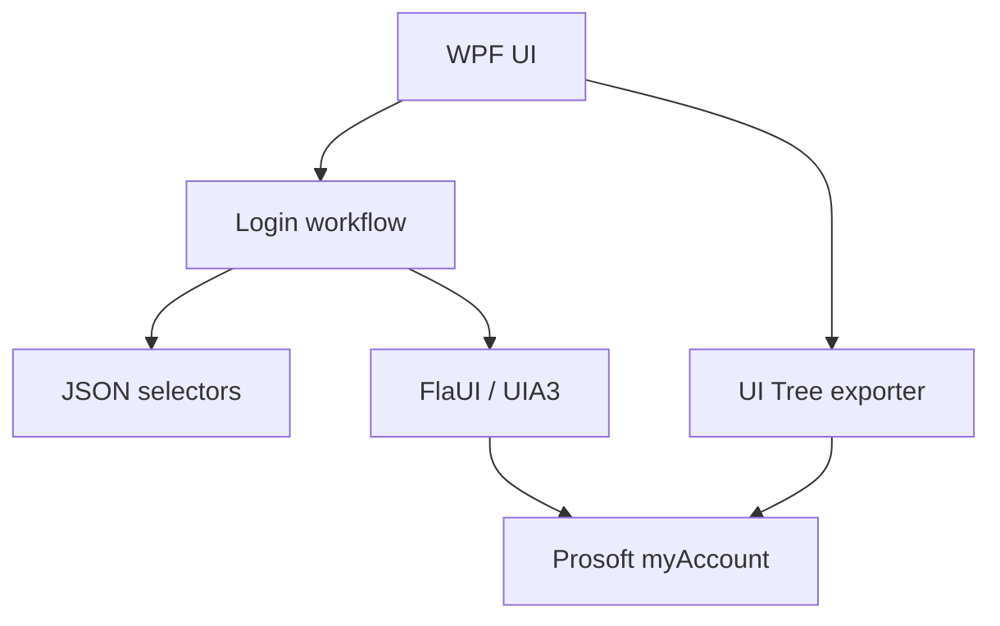
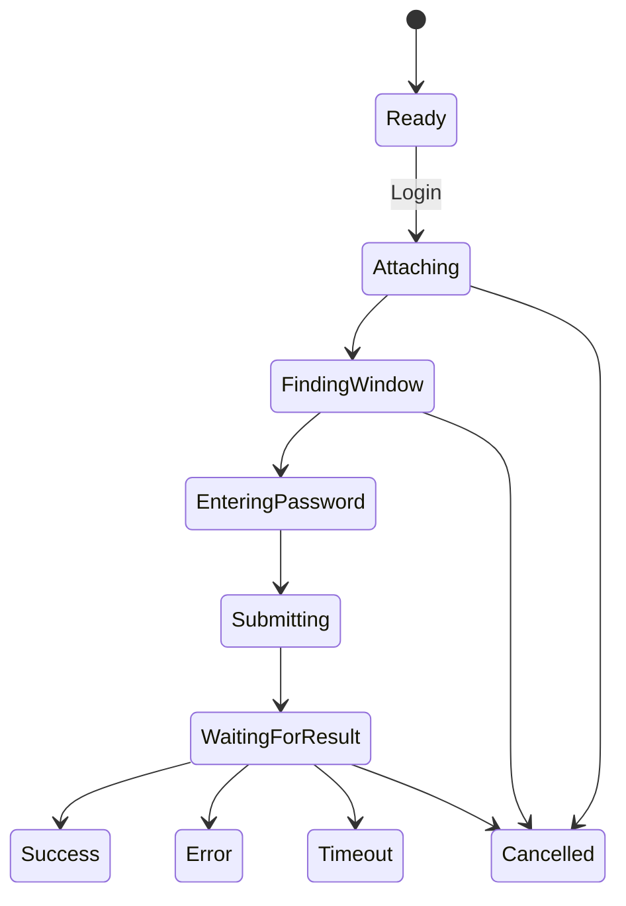

# Architecture

## Components



## Runtime flow



## Selector strategy

แต่ละ control มี selector หลายรายการเรียงจากเฉพาะเจาะจงไปหา fallback:

1. `AutomationId`
2. `NameContains + ControlType`
3. `ClassNameContains + ControlType`
4. `ControlType + Index`

ควรอัปเดต selector หลัง Export UI Tree บนเครื่องจริง เมื่อได้ค่าที่แน่นอนให้วาง selector นั้นไว้ลำดับแรก และเก็บ fallback ที่ปลอดภัยไว้ด้านล่าง

## Success detection

MVP ใช้หลักฐานอย่างใดอย่างหนึ่ง:

- พบ top-level window ที่ title ตรงกับ `SuccessWindowTitleContains`
- login window เดิมหายไป
- พบ dialog ใหม่ที่มี OK/ตกลง ให้ถือเป็น error และอ่านข้อความจาก Text control
- ไม่พบหลักฐานภายในเวลาที่กำหนด ให้คืน Timeout โดยไม่เดาว่าสำเร็จ

## Future extension point

เมื่อเริ่ม Excel workflow ให้เพิ่ม layer ใหม่ด้านบน automation เดิม:

```text
Excel Reader -> Validator -> Job Manager -> Prosoft Workflow -> Result Writer
```

อย่าให้ Excel reader เรียก FlaUI โดยตรง
